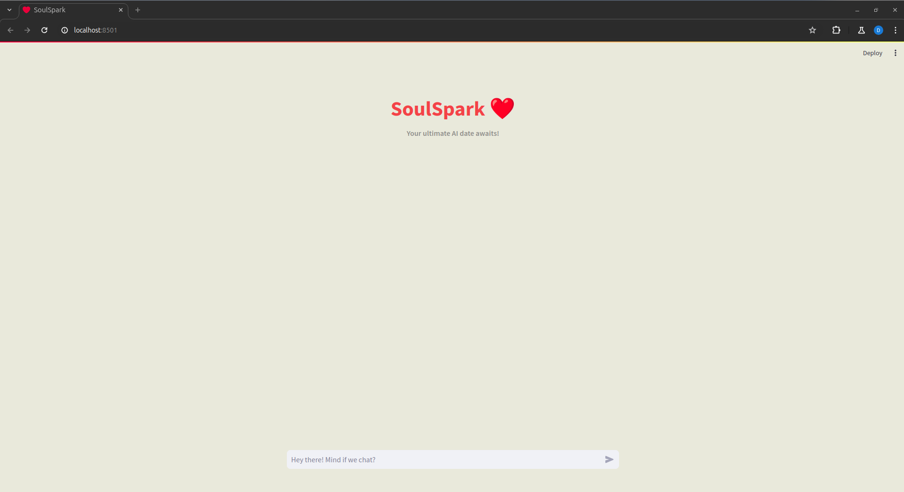
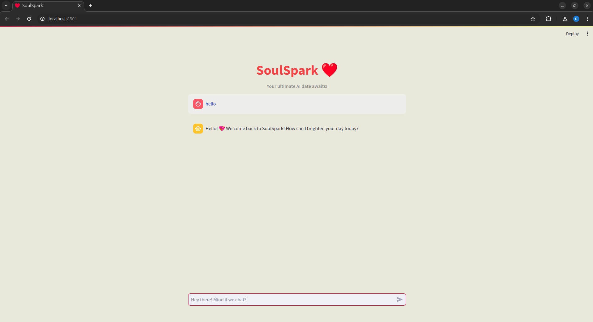

# SoulSpark 

---

### Welcome to this SoulSpark project using chatGPT API.
This project is an attempt to create an AI dates using ChatGPT APIs.
#### Requirements:
* Python, CSS
* Streamlit
* Pycharm/VSCode


##### To start in local
* set up conda/virtual env- **Python 3.12.0**
* clone the project-
```commandline
    git clone https://github.com/TMGA-WAY/SoulSpark.git
```

* Install all requirements
```commandline
    pip install -r requirement.txt
```
* Create a **secret.toml** file and paste below values
```commandline
    OPENAI_API_KEY= "YOUR API KEY"
```
* To get the API, visit below URL\
    [ChatGPT API](https://platform.openai.com/api-keys)

* To run the project-
```commandline
  streamlit run app.py
```


* Access the pages-
```commandline
http://localhost:4500
```



